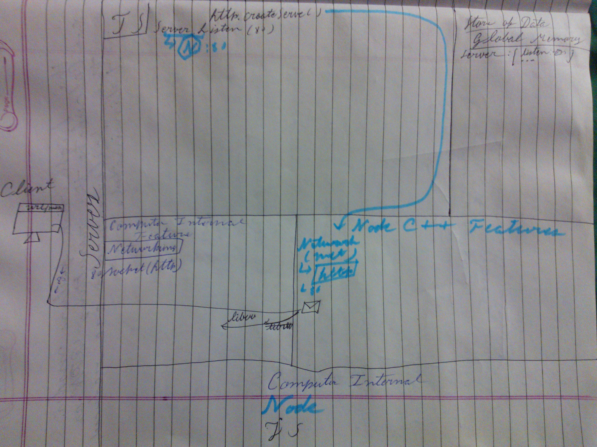
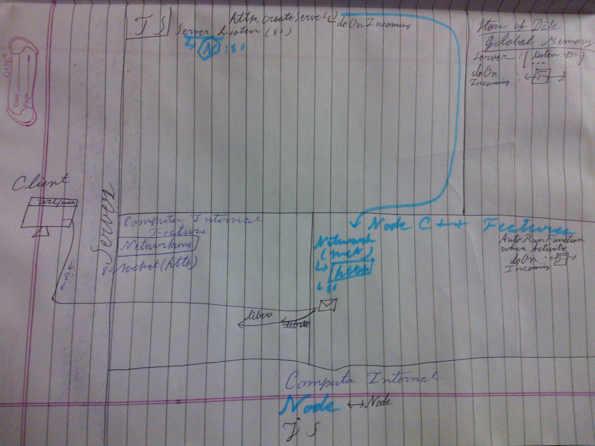
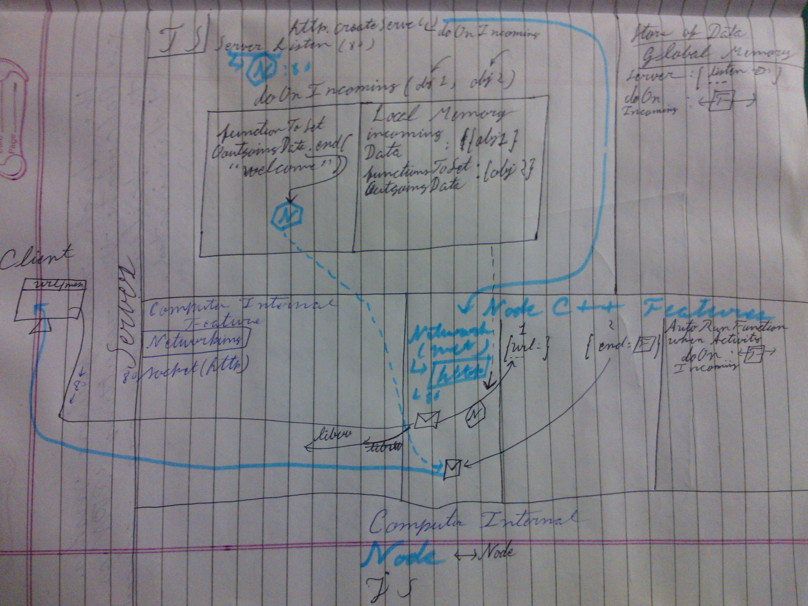

# Node

we can build applications that can interact with millions of users without blocking using Node. javascript doesn't allow us to Interact with the OS directly we can't create of modify the file or interact with cpu but we can use C/C++ that has many features to directly interact with OS so need combination of both C/C++ and JS that is the node

using node, javascript easily access the computer feature by labeling. javascript use labels and using libuv that labels use c++ functions that allow us to interact with os. eg ->
1.http
2.fs etc.

steps ->

1. js use label.
2. using libuv label use C++ functionsl
3. C++ interact with the OS directly.
4. js + c++ -> Node.js
   eg -> js label http,fs are in the c++.

in node js does 3 main things by itself ->

1. save data.
2. use that data.
3. use labels to interact with C++.
   eg ->

```javascript
// Step 1 Saving all the data
let num = 3;
function multiply_by_2(input) {
	const result = 2 * input;
	return result;
}

// Step 2 use saved data
const output1 = multiply_by_2(num); // 6
const output2 = multiply_by_2(10); // 20

// Step 3 use label to use c++ feature
const fs = require('fs');
```

# Node APIs

when we create our code than it use lable named server to access C++ feature that enables us to create a server that returns us an object contains method then we uses listen method from that object to interact with the client.

default port is 80.

```javascript
const server = http.createServer();
server.listen(80);
```



```javascript
function doOnIncoming(incomingData, functionToSetOutgoingData) {
	functionToSetOutgoingData.end('Welcome');
}
const server = http.createServer(doOnIncoming);
server.listen(80);
```



when **createServer** executed it automatically call **doOnIncoming** function that is passed as an argument. because javascript is single threaded synchronous so nodes slow work would done in the backgrosund.

node create two object instant when message get. first object contains url and the second object has bunch of methods.
so when **doOnIncoming** get executed it passes to arguments to that function one for incomingData and second for functionToSetOutgoingData.



# Node With HTTP

```javascript
const tweets = ['Hi', ' ', 'Hello', ' ', ' '];
function doOnIncoming(incomingData, functionsToSetOutgoingData) {
	const tweetNeeded = incomingData.url.slice(8) - 1;
	functionsToSetOutgoingData.end(tweets[tweetNeeded]);
}
const server = http.createServer(doOnIncoming);
server.listen(80);
```


send message/request -> http -> format

end() -> in the node set out http data

data -> chunks

node must be restart for change.

data is in http format so headers use to metadata and body for the data.

ssh used for interfacing with computer.

events used on server for handling conditions. like client side error etc.

http -> in node -> open socket
and return object.

error comes first as parameter in node.

callstack ->
js way to track code.

json data are partially in buffer.

onclose event take all stringify json and turned into object.

Some queues in nodejs ->

1. TimerQueue.
2. IOQueue(Network, File all data almost 95%).
3. CheckQueue.
4. CloseQueue.
5. MicrotaskQueue it has higher priority it's actually is two.
